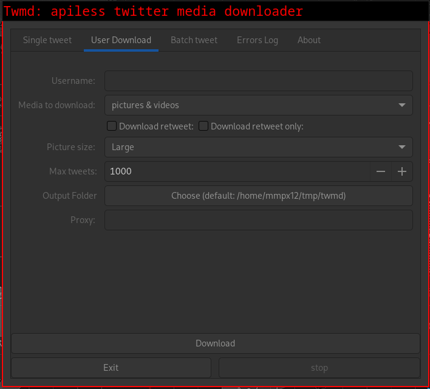

# twmd: CLI twitter media downloader (without api key)

This twitter downloader doesn't require Credentials or an api key. It's based on [twitter-scrapper](https://github.com/imperatrona/twitter-scraper).

Unfortunately, you will not be able to download more than 3200 tweets.


**Note:** Gui is not longer maintained.

## usage: 

```
Usage:
-h, --help                   Show this help
-u, --user     USERNAME      User you want to download
-t, --tweet    TWEET_ID      Single tweet id to download
-n, --nbr      NBR           Number of tweets to download
-i, --img                    Download images only
-g, --gif                    Download GIFs only (need ffmpeg)
-v, --video                  Download videos only
-a, --all                    Download images, GIFs(need ffmpeg) and videos
-r, --retweet                Download retweet too
-z, --url                    Print media url without download it
-R, --retweet-only           Donwload only retweet
-M, --mediatweet-only        Donwload only media tweet
-s, --size     SIZE          Choose format between small|normal|large
                             (default large)
-U, --update                 Download missing tweet only
-L, --login                  Log in to your account
-P, --login-plaintext        Plain text Login (needed for NSFW tweets)
-o, --output   DIR           Output directory
-f, --file-format FORMAT     Formatted name for the downloaded file
-d, --date-format FORMAT     Apply custom date format. (https://go.dev/src/time/format.go)
-p, --proxy    PROXY         Use proxy (proto://ip:port)
-V, --version                Print version and exit
-B, --[no-]banner            Don't print banner
```

### Examples:

#### Download 300 tweets from @Spraytrains.

If the tweet doesn't contain a photo, gif or video nothing will be downloaded but it will count towards the 300.

```sh
twmd -u Spraytrains -o ~/Downloads -a -n 300
```

Due to rate limits of twitter, it is possible to fetch at most 500–600 tweets.
To fetch as more tweets as possible, change the argument of `-n` to a bigger number, like 3000.

You can use `-r|--retweet` to download retweets as well, or `-R|--retweet-only` to download retweet only

`-U|--update` will only download missing media.

#### Download a single tweet:

```sh
twmd -t 156170319961391104
```

#### Download animated-GIFs:

Animated-GIFs are downloaded as mp4 files.
If you want to get them as gif files, you need to install ffmpeg.

#### NSFW tweets

You'll need to login `-L|--login` for downloading nsfw tweets.


#### Using proxy

Both http and socks4/5 can be used:

```sh
twmd  --proxy socks5://127.0.0.1:9050 -t 156170319961391104
```

### Installation:


**Note:** If you don't want to build it you can download prebuilt binaries [here](https://github.com/mmpx12/twitter-media-downloader/releases/latest).


#### Cli:

```sh
git clone https://github.com/mmpx12/twitter-media-downloader.git
cd twitter-media-downloader
make
sudo make install
# OR
sudo make all
# Clean
sudo make clean
```

#### Gui (outdated):

```sh
git clone https://github.com/mmpx12/twitter-media-downloader.git
cd twitter-media-downloader
# linux
make linux-gui
# windows
make windows-gui
```


#### Termux (no root):

installation: 

```sh
git clone https://github.com/mmpx12/twitter-media-downloader.git
cd twitter-media-downloader
make
make termux-install
# OR
make termux-all
# Clean
make termux-clean
```

You may also want to add stuff in ~/bin/termux-url-opener to automatically download profile or post when share with termux.

```sh
cd ~/storage/downlaods
if grep twitter <<< "$1" >/dev/null; then
  if [[ $(tr -cd '/' <<< "$1" | wc -c) -eq 3 ]]; then
    userid=$(cut -d '/' -f 4 <<< "$1" |  cut -d '?' -f 1)
    echo "$userid"
    twmd -B -u "$userid" -o twitter -i -v -n 3000
  else 
    postid=$(cut -d '/' -f 6 <<< "$1" |  cut -d '?' -f 1)
    twmd -B -t "$postid" -o twitter
  fi
fi
```


Check [here](https://gist.github.com/mmpx12/f0741d40909ed3f182fd6f9b33b580d7) for a full termux-url-opener example.
